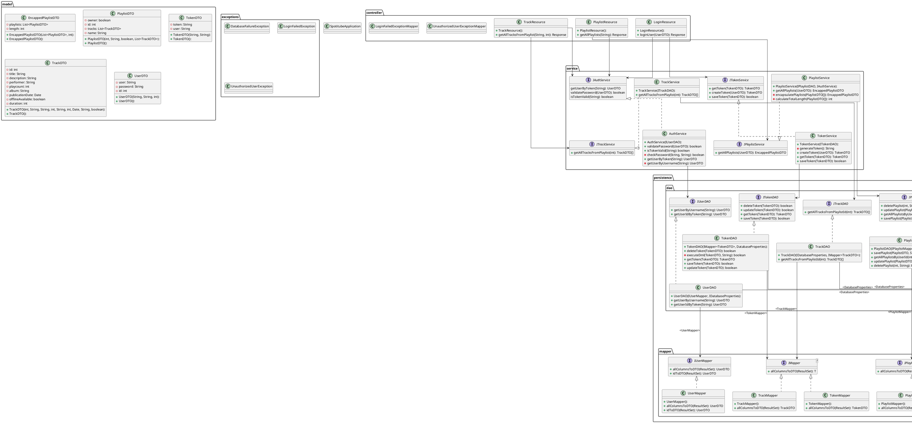

```plantuml
@startuml
skinparam linetype ortho

package "config" {
  class CORSFilter
  class DatabaseProperties {
    - connectionString: String
    + DatabaseProperties():
  }
  interface IDatabaseProperties  {
    connectionString: String
  }
}

package "controller" {
  class LoginResource {
    + LoginResource():
    + loginUser(UserDTO): Response
  }
  class TrackResource {
    + TrackResource():
    + getAllTracksFromPlaylist(String, int): Response
  }
  class PlaylistResource {
    + PlaylistResource():
    + getAllPlaylists(String): Response
  }
  class UnauthorizedUserExceptionMapper
  class LoginFailedExceptionMapper
}

package "model" {
  class EncappedPlaylistDTO {
    + EncappedPlaylistDTO(List<PlaylistDTO>, int):
    + EncappedPlaylistDTO():
    - playlists: List<PlaylistDTO>
    - length: int
  }
  class PlaylistDTO {
    + PlaylistDTO(int, String, boolean, List<TrackDTO>):
    + PlaylistDTO():
    - owner: boolean
    - id: int
    - tracks: List<TrackDTO>
    - name: String
  }
  class TokenDTO {
    + TokenDTO(String, String):
    + TokenDTO():
    - token: String
    - user: String
  }
  class TrackDTO {
    + TrackDTO(int, String, String, int, String, int, Date, String, boolean):
    + TrackDTO():
    - id: int
    - title: String
    - description: String
    - performer: String
    - playcount: int
    - album: String
    - publicationDate: Date
    - offlineAvailable: boolean
    - duration: int
  }
  class UserDTO {
    + UserDTO(String, String, int):
    + UserDTO():
    - user: String
    - password: String
    - id: int
  }
}

package "service" {
  interface IPlaylistService  {
    + getAllPlaylists(UserDTO): EncappedPlaylistDTO
  }
  
  class AuthService {
    + AuthService(IUserDAO):
    + validatePassword(UserDTO): boolean
    + isTokenValid(String): boolean
    - checkPassword(String, String): boolean
    + getUserByToken(String): UserDTO
    - getUserByUsername(String): UserDTO
  }
  
  interface IAuthService  {
    getUserByToken(String): UserDTO
    validatePassword(UserDTO): boolean
    isTokenValid(String): boolean
  }
  
  interface ITokenService {
    + getToken(TokenDTO): TokenDTO
    + createToken(UserDTO): TokenDTO
    + saveToken(TokenDTO): boolean
  }
  
  interface ITrackService  {
    + getAllTracksFromPlaylist(int): TrackDTO[]
  }
  
  class PlaylistService {
    + PlaylistService(IPlaylistDAO, IAuthService):
    + getAllPlaylists(UserDTO): EncappedPlaylistDTO
    - encapsulatePlaylists(PlaylistDTO[]): EncappedPlaylistDTO
    - calculateTotalLength(PlaylistDTO[]): int
  }
  
  class TokenService {
    + TokenService(ITokenDAO):
    - generateToken(): String
    + createToken(UserDTO): TokenDTO
    + getToken(TokenDTO): TokenDTO
    + saveToken(TokenDTO): boolean
  }
  
  class TrackService {
    + TrackService(ITrackDAO):
    + getAllTracksFromPlaylist(int): TrackDTO[]
  }
}

package "persistence" {
    package "dao" {
    interface IPlaylistDAO  {
        + deletePlaylist(int, String): boolean
        + updatePlaylist(PlaylistDTO, String): boolean
        + getAllPlaylistsByUserId(int): PlaylistDTO[]
        + savePlaylist(PlaylistDTO, String): boolean
    }
    interface ITokenDAO {
        + deleteToken(TokenDTO): boolean
        + updateToken(TokenDTO): boolean
        + getToken(TokenDTO): TokenDTO
        + saveToken(TokenDTO): boolean
    }
    interface ITrackDAO  {
        + getAllTracksFromPlaylistId(int): TrackDTO[]
    }
    interface IUserDAO  {
        + getUserByUsername(String): UserDTO
        + getUserIdByToken(String): UserDTO
    }
      class PlaylistDAO {
        + PlaylistDAO(IPlaylistMapper, DatabaseProperties):
        + savePlaylist(PlaylistDTO, String): boolean
        + getAllPlaylistsByUserId(int): PlaylistDTO[]
        + updatePlaylist(PlaylistDTO, String): boolean
        + deletePlaylist(int, String): boolean
    }
    class TokenDAO {
        + TokenDAO(IMapper<TokenDTO>, DatabaseProperties):
        + deleteToken(TokenDTO): boolean
        - executeDml(TokenDTO, String): boolean
        + getToken(TokenDTO): TokenDTO
        + saveToken(TokenDTO): boolean
        + updateToken(TokenDTO): boolean
    }
    class TrackDAO {
        + TrackDAO(IDatabaseProperties, IMapper<TrackDTO>):
        + getAllTracksFromPlaylistId(int): TrackDTO[]
    }
    class UserDAO {
        + UserDAO(IUserMapper, IDatabaseProperties):
        + getUserByUsername(String): UserDTO
        + getUserIdByToken(String): UserDTO
    }
    }
    package "mapper" {
      interface IMapper<T>  {
        + allColumnsToDTO(ResultSet): T
      } 
      interface IPlaylistMapper  {
        + allColumnsToDTO(ResultSet, int): PlaylistDTO
      }
      interface IUserMapper  {
        + allColumnsToDTO(ResultSet): UserDTO
        + idToDTO(ResultSet): UserDTO
      }
      class PlaylistMapper {
        + PlaylistMapper():
        + allColumnsToDTO(ResultSet, int): PlaylistDTO
      }
      class TokenMapper {
        + TokenMapper():
        + allColumnsToDTO(ResultSet): TokenDTO
      }
      class TrackMapper {
        + TrackMapper():
        + allColumnsToDTO(ResultSet): TrackDTO
      }
      class UserMapper {
        + UserMapper():
        + allColumnsToDTO(ResultSet): UserDTO
        + idToDTO(ResultSet): UserDTO
      }
    }
}

package "exceptions" {
  class DatabaseFailureException
  class LoginFailedException
  class UnauthorizedUserException
}

class SpotitubeApplication 

LoginResource -d-> IAuthService
LoginResource -d-> ITokenService

PlaylistResource -d-> IAuthService
PlaylistResource -d-> IPlaylistService

TrackResource -d-> IAuthService
TrackResource -d-> ITrackService

TrackService .d.|> ITrackService
TrackService -d-> ITrackDAO

PlaylistService .d.|> IPlaylistService
PlaylistService -d-> IPlaylistDAO

TrackDAO .u.|> ITrackDAO
TrackDAO -d-> IMapper : <TrackMapper>

PlaylistDAO .u.|> IPlaylistDAO
PlaylistDAO -d-> IPlaylistMapper : <PlaylistMapper>

AuthService -d-> IUserDAO
AuthService .u.|> IAuthService

TokenService -d-> ITokenDAO
TokenService .u.|> ITokenService

UserDAO .u..|> IUserDAO
UserDAO -d--> IUserMapper : <UserMapper>

TokenDAO .u.|> ITokenDAO
TokenDAO -d-> IMapper : <TokenMapper>

TrackMapper .u.|> IMapper
PlaylistMapper .u.|> IPlaylistMapper
UserMapper .u.|> IUserMapper
TokenMapper .u.|> IMapper

DatabaseProperties .u.|> IDatabaseProperties

TrackDAO -u-> IDatabaseProperties : <DatabaseProperties>
PlaylistDAO -u-> IDatabaseProperties : <DatabaseProperties>
UserDAO -d-> IDatabaseProperties : <DatabaseProperties>
TokenDAO -d-> IDatabaseProperties : <DatabaseProperties>
@enduml
```
