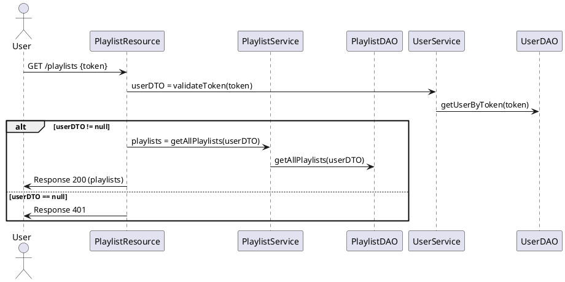

# Sequence diagram for Seeing All Playlists

```plantuml
@startuml
actor User
participant "PlaylistResource" as PR
participant "PlaylistService" as PS
participant "PlaylistDAO" as PD
participant "UserService" as US
participant "UserDAO" as UD

User -> PR: GET /playlists {token}
PR -> US: userDTO = validateToken(token)
US -> UD: getUserByToken(token)
alt userDTO != null
    PR -> PS: playlists = getAllPlaylists(userDTO)
    PS -> PD: getAllPlaylists(userDTO)
    PR -> User: Response 200 (playlists)
else userDTO == null
    PR -> User: Response 401
end

```